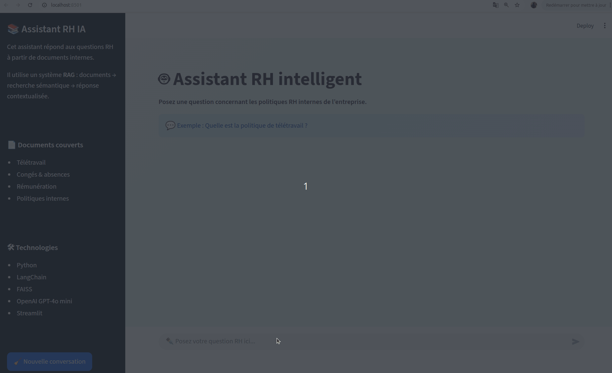

## Technologies utilisées

## 🤖 Chatbot RH Intelligent — RAG + OpenAI + FAISS
💼 Assistant conversationnel permettant de consulter automatiquement les politiques RH internes (PDF) via un système de Retrieval-Augmented Generation (RAG).

- Réponses contextualisées basées sur les documents internes
- Recherche sémantique avec FAISS + embeddings
- Interface interactive Streamlit
- Déploiement cloud avec Streamlit Cloud
- Mémoire conversationnelle + citations des sources  
---
### Démonstration interactive

### 🚀 Application déployée sur Streamlit Cloud : 
[Tester l’application ici](https://chatbot-rh-rag-scmr8r8njizt9pvbp6268f.streamlit.app/)

💬 Exemples de questions :
- "Combien de jours de télétravail sont autorisés ?"
- "Quelle est la politique de congés ?"
- "L’employeur peut-il imposer le télétravail en cas de crise sanitaire ou de confinement ?"
- "Combien de jours de RTT un salarié à temps complet peut-il obtenir par an et quelles sont les conditions de prise ?"
- "Quels frais liés au télétravail peuvent être pris en charge par l’entreprise ?"

---
### Objectif métier

Dans de nombreuses entreprises, les informations RH sont :
- dispersées dans des PDF
- difficiles à rechercher
- peu accessibles aux employés

**Ce projet montre comment :**
- transformer des documents internes en **base de connaissance interrogeable en langage naturel**
- automatiser les réponses aux questions RH
- améliorer l’accès à l’information interne

---
### Impact business

**Ce système permet :**

- 📉 Réduction du nombre de tickets RH
- ⏰ Gain de temps pour les employés
- 📚 Accès instantané aux politiques internes
- 🤖 Automatisation des FAQ (Foire Aux Questions) RH

**👉 Impact : ce type de solution peut réduire jusqu’à 30–50% des sollicitations RH simples.**

---

### Architecture

Pipeline complet de type RAG :

1. 📄 Ingestion des documents RH (PDF)
2. ✂️ Découpage en chunks (LangChain)
3. 🔎 Création d’embeddings (MiniLM)
4. 🧠 Indexation vectorielle (FAISS)
5. 🔍 Recherche sémantique
6. 🤖 Génération de réponse (GPT-4o-mini)
7. 🌐 Interface utilisateur (Streamlit)

---
## Architecture technique

- Ingestion : PyPDFLoader
- Processing : LangChain (chunking)
- Embeddings : Sentence Transformers (MiniLM)
- Stockage vectoriel : FAISS
- LLM : OpenAI (gpt-4o-mini)
- Frontend : Streamlit
- CI/CD : GitHub Actions
- Déploiement : Streamlit Cloud
---

---

## 📊 Résultats

- ⏰ Temps de réponse rapide (< 2s)
- 🎯 Réponses contextualisées basées sur les documents internes
- 📉 Réduction potentielle de la charge RH
- 📚 Accès simplifié à l’information

---

### Stack technique

#### NLP / RAG
- LangChain
- FAISS
- Sentence-Transformers (MiniLM)
- OpenAI (gpt-4o-mini)

#### Backend / App
- Python 3.11
- Streamlit

#### MLOps / DevOps
- GitHub Actions (CI)
- Streamlit Cloud (déploiement)
- Gestion des secrets (.env + Streamlit)

### Installation locale

git clone https://github.com/DataEngineer87/chatbot-rh-rag-openai.git
cd chatbot-rh-rag-openai

conda create -n Projet_rag_rh python=3.11 -y
conda activate Projet_rag_rh

pip install -r requirements.txt

---
## Configuration de clé OpenAI
Créer un fichier sur votre machine .env :

OPENAI_API_KEY=votre_clé_ici

---
## Génération d’index
python index.py

## Lancement d’application
streamlit run app_streamlit.py

## Déploiement

- Push du projet sur GitHub
- Déploiement via Streamlit Cloud
- Ajout de la clé OpenAI dans les secrets streamlit

## Industrialisation

- CI/CD avec GitHub Actions
- Déploiement cloud (Streamlit)
- Architecture modulaire
- Extension possible vers API (FastAPI) et Docker

## Limites & améliorations

- Amélioration du ranking des documents
- Ajout de mémoire conversationnelle
- Intégration avec Slack / Teams
- Passage à une base vectorielle scalable (Pinecone, Weaviate)

## Ce qui rend ce projet pertinent
- Cas d’usage métier réel (RH)
- Pipeline RAG complet de bout en bout
- Déploiement accessible et fonctionnel
- Approche orientée produit et impact

## Compétences démontrées

- IA générative & RAG appliqué à un cas concret
- NLP et recherche sémantique
- Construction d’un pipeline complet :
- data → embeddings → recherche → génération → application
- Déploiement cloud & CI/CD
- Approche orientée produit

## Auteur
### Alseny
Data Scientist | MLOps | GenAI

